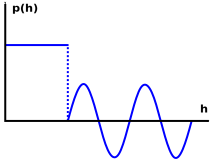

Exending the model
==================

Adding new functions
--------------------

The atmosphere class can be easily extended with custom atmospheric properties. The easiest way to do this, is to subclass from ``Atmosphere``, and to add custom methods to your new, extended atmosphere object (here ``MyExtendedAtmosphere``).

.. code:: python

    >>> from ambiance import Atmosphere

    >>> class MyExtendedAtmosphere(Atmosphere):
    ...     @property
    ...     def specific_humidity(self):
    ...         return 2*self.h  # Define your own function of altitude here...
    ...

    >>> atmos = MyExtendedAtmosphere([0, 1, 100])
    >>> atmos.specific_humidity
    array([  0.,   2., 200.])

In the example above, an additional atmospheric property (``specific_humidity``) was added. Note that by adding the decorator ``@property``, we do not need to call the function using parentheses. The example shows a dummy function which multiplies the altitude by a factor of two, but you can replace the expression with any function you like. The variable ``self.h`` is the *geometric* altitude (``self.H`` is the geopotential altitude, see also :ref:`sec_user_guide`).

.. hint::

    When subclassing, all the existing functionality will still remain and you will be able to access the other properties like temperature or pressure.

Avoiding if-statements
----------------------

Consider some atmospheric property :math:`p` as a function of altitude :math:`h`. Now, if there is a kink or sudden change in the model :math:`p = p(h)`, we may need different expressions for the different regions. Lets consider the following graph as a hypothetical example model.

Up to some altitude, the property :math:`p` is constant. At higher altitude the function looks like a sine-curve. With the *Numpy* library we can handle such models without the need for any if-statements

.. code:: python

    >>> from ambiance import Atmosphere
    >>> import numpy as np

    >>> class MyExtendedAtmosphere(Atmosphere):
    ...     @property
    ...     def specific_humidity(self):
    ...         # Get the array positions for altitudes below and above 1000 meter.
    ...         # Example:
    ...         # self.h = [0, 500, 900, 2000, 50e3]
    ...         # --> pos_lower = [1, 1, 1, 0, 0]
    ...         # --> pos_upper = [0, 0, 0, 1, 1]
    ...         pos_lower = (self.h < 1000).astype(int)
    ...         pos_upper = 1 - pos_lower
    ...
    ...         spec_humidity = pos_lower*222  # if h < 0
    ...         spec_humidity = spec_humidity + pos_upper*np.sin(self.h)  # if h >= 0
    ...
    ...         return spec_humidity
    ...

    >>> atmos = MyExtendedAtmosphere([0, 500, 900, 2000, 50e3])
    >>> atmos.specific_humidity
    array([222.        , 222.        , 222.        ,   0.9300395 ,
            -0.99984019])

Additional arguments
--------------------

You may of course define functions with additional arguments. In this case we omit the decorator ``@property``. However, this means we cannot retrieve our atmospheric property by writing ``atmos.specific_humidity``. Instead, we need to call the method using parentheses.

.. code:: python

    >>> from ambiance import Atmosphere
    >>> import numpy as np
    >>>
    >>> class MyExtendedAtmosphere(Atmosphere):
    ...     def specific_humidity(self, model=1):
    ...         if model == 1:
    ...             return 2*self.h
    ...         else:
    ...             return np.log10(self.h)
    ...
    >>> atmos = MyExtendedAtmosphere([1, 10, 100])
    >>> atmos.specific_humidity()
    array([  2.,  20., 200.])
    >>> atmos.specific_humidity(model=2)
    array([0., 1., 2.])

